```{r setup, echo = F}
knitr::opts_chunk$set(
  comment = "#",
  #cache = TRUE,
  collapse = TRUE,
  warning = FALSE,
  message = FALSE,
  fig.width = 7,
  fig.height = 5.25,
  fig.align = 'center',
  fig.retina = 3
)

# base plot layout
mypar = list(mar = c(3,3,0.5,0.5), mgp = c(1.5, 0.3, 0), tck = -.008)

# xaringan Extra
xaringanExtra::use_xaringan_extra(c("tile_view", "animate_css", "tachyons"))
xaringanExtra::use_extra_styles(
  hover_code_line = TRUE,         #<<
  mute_unhighlighted_code = TRUE  #<<
)
xaringanExtra::use_editable(expires = 1)
xaringanExtra::use_panelset()
```
class: middle, title-slide

<!-- top logo (comment to remove or edit on `conf/css/style.css:23`) -->
<div class="lab-logo"></div>
<!-- <div class="bios2-logo"></div> -->

# Le rôle du climat et de la compétition sur l'aire de répartition des arbres

<hr width="65%" align="left" size="0.3" color="orange"></hr>

## une approche multi-échelle de l'individu à la métapopulation

### Willian Vieira

<br><br><br>
[<i class="fa fa-github fa-lg" style="color:#e7e8e2"></i> WillVieira/talk_seminar2](https://github.com/willvieira/talk_seminar2)

---

# Introduction

- Comprendre comment les arbres vont réagir au changements climatiques

--
- SDM: la seule méthode qui nécessite d'une séance de thérapie

--
- Modèles mécanistiques appué par la théorie

--
- Modèle de dynamique basé sur la théorie de la metapopulation


.cite[Vissault et al. [2020](https://link) Journal of Biogeography]

---

.center[
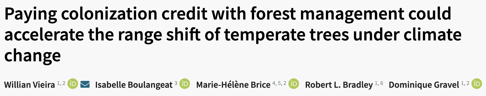
]

---

#### Paying colonization credit with forest management could accelerate the range shift of temperate trees under climate change


.center[

]

---

# Conclusions

- Plantation est plus efficace que la coupe pour augmenter la resilience et accelerer la dynamique de migration

--
- Peu d'information à l'echèlle locale

--
- Pas de difference entre les espèces


---
class: middle, center, inverse

# Les taux demographiques

<hr width="100%" align="left" size="0.3" color="orange"></hr>

#### Une unité centale pour comprendre la dynamique des forets

---
# La démographie en tant que nœd central entre les différentes échelles

.center[
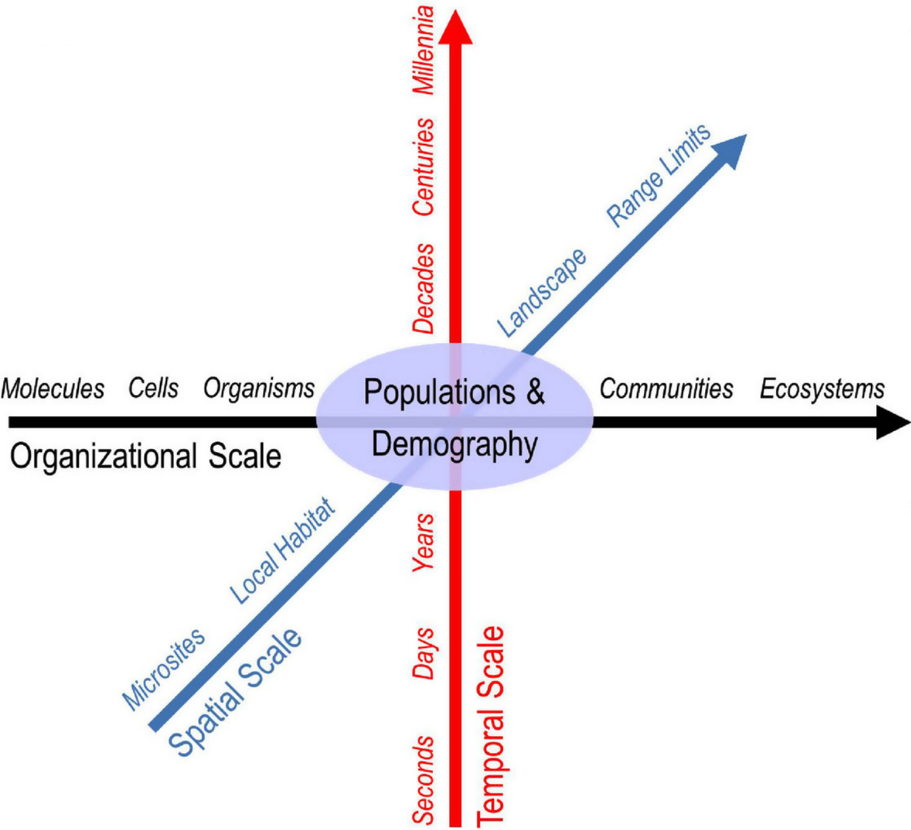
]

.cite[Griffith et al. 2016 Journal of Ecology]

---

# Lien entre les taux demographique et l'aire de répartition d'une espèce

<br>

$r \sim Climat$

.center[

]

.cite[Maguire Jr 1973 Am. Natur.; Holt 2009 PNAS; Fig adapted from Godsoe et al. 2017 TREE]

---

# Lien entre les taux demographique et l'aire de répartition d'une espèce

<br>

$r \sim Climat + compétition$

.center[

]

.cite[Maguire Jr 1973 Am. Natur.; Holt 2009 PNAS; Fig adapted from Godsoe et al. 2017 TREE]

---

# Modèle de distribution démographique

<br>
.center[

]

.cite[Schurr et al. 2012 Journal of Biogeography]


---

# L'effet du climat et de la compétition peut être différent dans l'aire de répartition

<br>

.center[
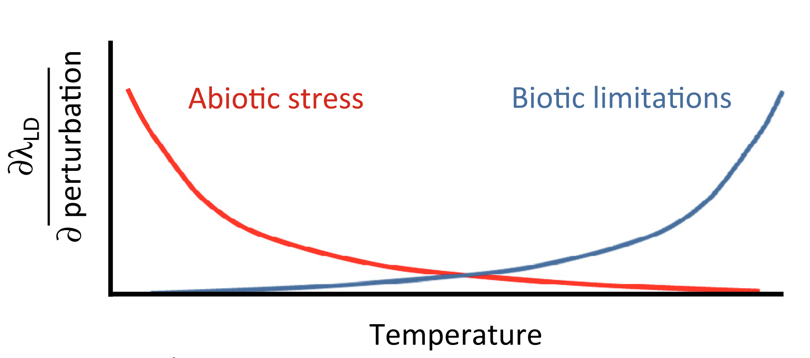
]

.cite[Louthan et al. 2015 TREE]

---

# Les différentes sources de variabilité démographique

.center[
  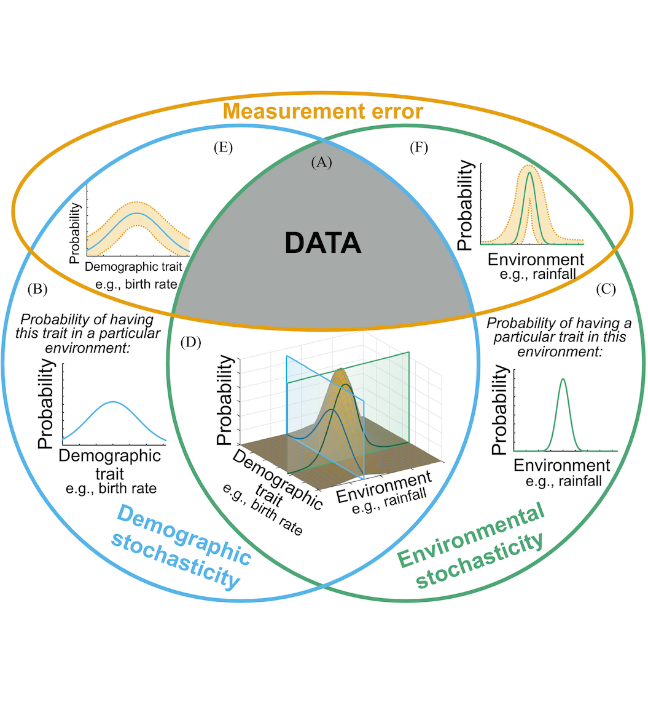
]

.cite[Adapté de Shoemaker et al. 2020 Ecology]

---


# Les différentes sources de variabilité démographique

.center[
  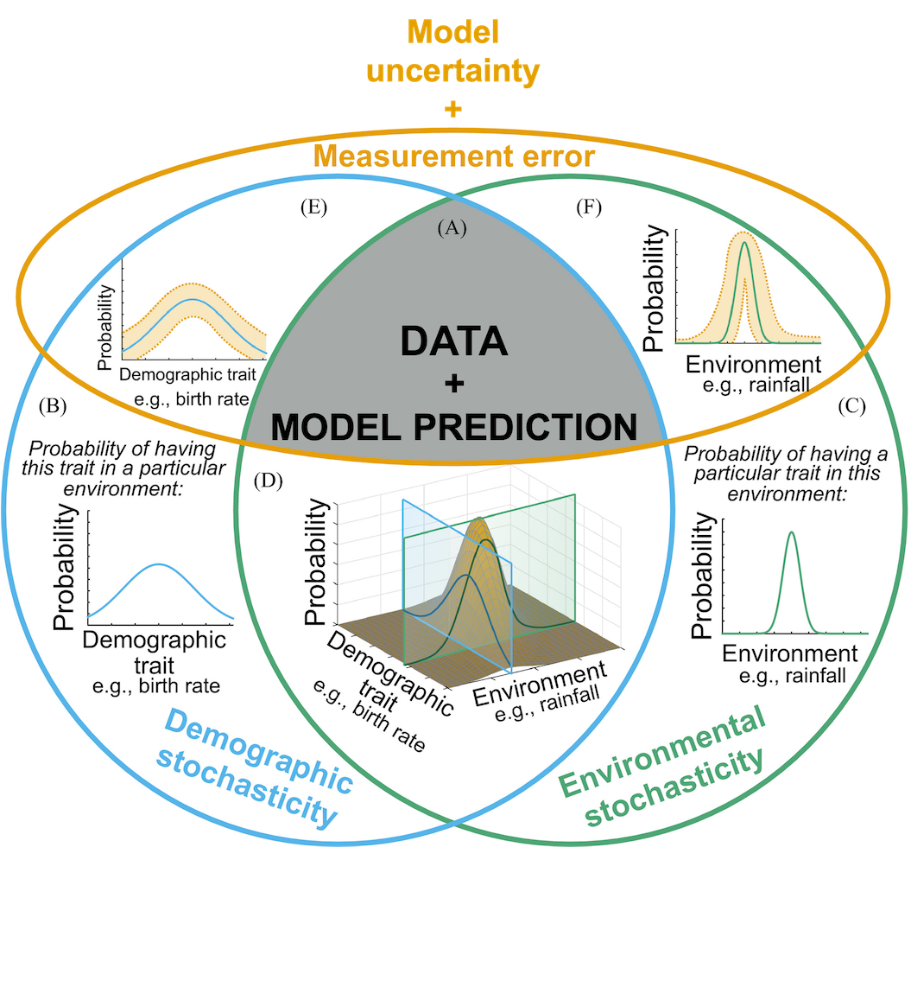
]

.cite[Adapté de Shoemaker et al. 2020 Ecology]

---

# Les différentes sources de variabilité démographique

.center[
  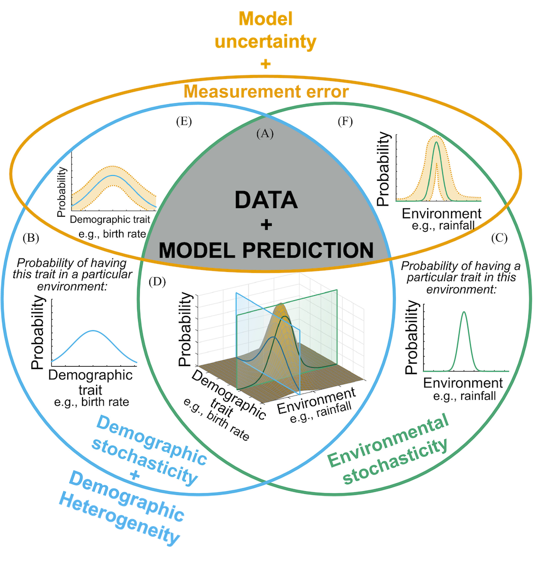
]

.cite[Adapté de Shoemaker et al. 2020 Ecology]

---

# Les différentes sources de variabilité démographique

.center[
  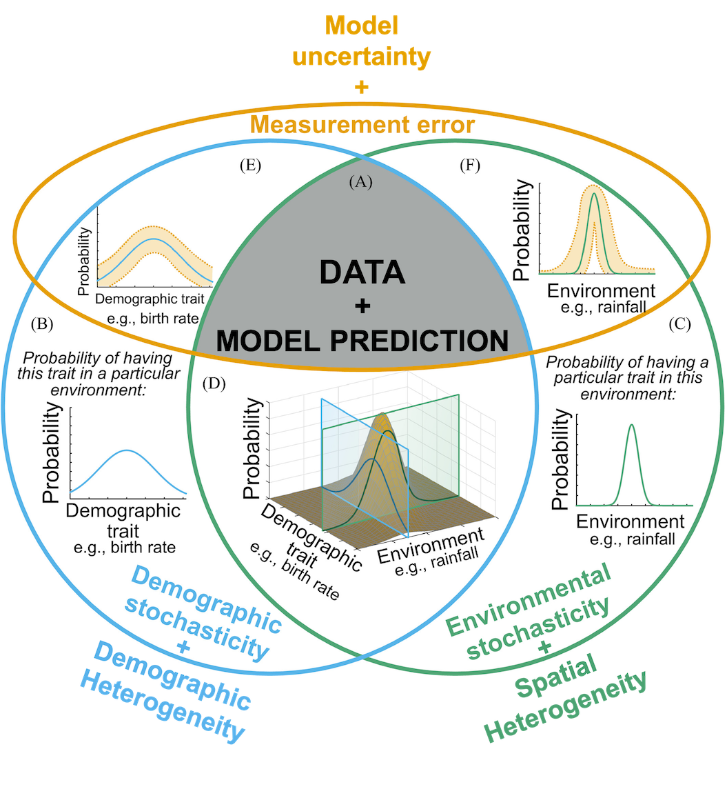
]

.cite[Adapté de Shoemaker et al. 2020 Ecology]

---

# L'effet de la variabilité sur le taux démographique peu être <span style='color: #67a9cf;'>positif</span> ou <span style='color: #ef8a62;'>negatif</span>

- <span style='color: #ef8a62;'>Risque d'extinction</span>

<br>

.center[
  
]

.cite[Holt et al. 2005 Oikos]

---

# L'effet de la variabilité sur le taux démographique peu être <span style='color: #67a9cf;'>positif</span> ou <span style='color: #ef8a62;'>negatif</span>

- <span style='color: #ef8a62;'>Risque d'extinction</span>
- <span style='color: #67a9cf;'>Inégalité de Jensen</span>

.center[
  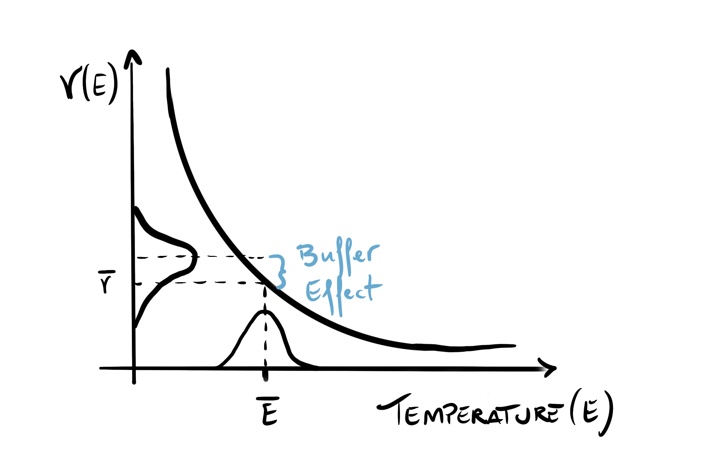
]

---
class: center, inverse


### Quantifier l'effet de la compétition et du climate sur les taux démographiques des arbres

Comment l'effet relative entre compétition et climate varie dans <br>le gradient de l'aire de répartition

--

<hr width="100%" align="left" size="0.3" color="orange"></hr>

### Quantifier l'effet de la variabilité des taux démographiques sur le limite de l'aire de répartition

Quelle est le rôle de l'**incertude**, de la **stochasticité environmentalle**, et de l'**heterogenité spatiale** dans le gradient de l'aire de répartition

---

# L'approche

Comment quantifier l'effet de la **compétition** et du **climate** sur les taux démographiques des arbres?

--

- $\lambda \sim compétition + climat$

--

- $\lambda$ est decomposé en 3 sous modèles:
  - Croissance
  - Survie
  - recrutement

--

- Modèle de Projection Integrale (IPM)

--

- Modèles hiérarchiques non linéaires bayésiens

--
  - Hiérarchique: variance partitioné à differentes échelles
  - non linéaire: modèles mechanistique basé sur l'écologie
  - Bayésien: pour tracer l'incertitude


---

# Les données

.center[

]

---

# Les données

.pull-left1[
  
]

.pull-right1[
- 31 espèce d'arbres
- 22 feuillus + 9 conifères
- Tolerance à l'ombre
- Sucession
]

---

# Les modèles démographiques

- Modèle de croissance de Von Bertalanffy (~ temps + taille)

.center[]

---

# Les modèles démographiques

- Modèle de croissance de Von Bertalanffy (~ temps + taille)
- Modèle de survie (~ temps)

.center[]

---

# Les modèles démographiques

- Modèle de croissance de Von Bertalanffy (~ temps + taille de l'individue)
- Modèle de survie (~ temps)
- Modèle de recrutement (~ temps + taille de la parcelle)

.center[]

---

# Les covariables - compétition

- $\beta$: l'effêt totale de la surface terrière des **individus plus grands**
- $\theta$: l'effêt partagé entre conspécifique et heterospécifique

.center[]

---

# Les covariables - climat

- $\xi$: climat optimal
- $\sigma$: étendue de la niche

.center[]

---

# Validation des modèles

- Modèle construit en increment
  - Effêt aléatoire sur la parcelle -> compétition -> climat

--

- Leave-One-Out Cross-Validation (LOO-CV)

.center[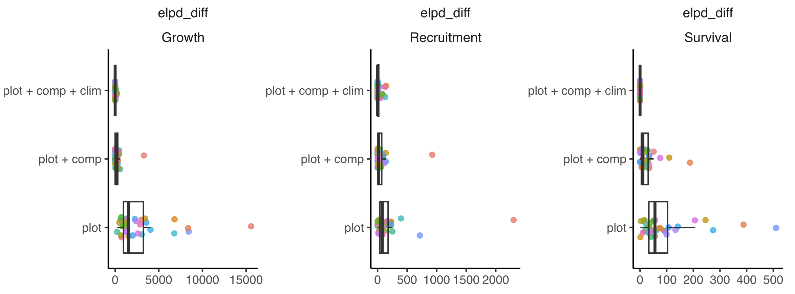]

- Le modèle complet (parcelle + compétiton + climat) est le plus performant

---

# Validation des modèles

- LOO-CV est relative aux modèles testé

--

- Comparer les paramètres avec les valuers de trait en littérature

---

# Validation des modèles

**Croissance**: la taille maximale prédite pour une espèce est corrélée à la taille maximale de espèce trouvée dans la littérature

.center[]

.cite[Burns et al. 1990]

---

# Validation des modèles

**Survie**: la longévité prédite pour une espèce est corrélée à l'âge maximum trouvé dans la littérature

.center[]

.cite[Burns et al. 1990]

---

# Validation des modèles

**Recrutement**: le taux de recrutement d'une espèce est corrélé à la masse des graines

.center[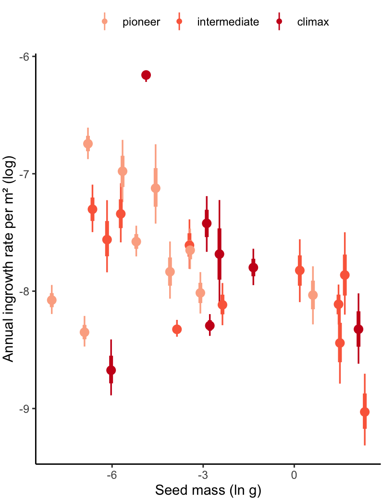]

.cite[Dı́az et al. 2022]

---

# Validation des modèles

**Compétition**: l'effet de la densité augument pour le espèces que sont intolerant à l'ombre

.center[]

.cite[Burns et al. 1990]

---

# Validation des modèles

**Climat**: l'optimale climatique n'est pas corrélée avec le centre de la distribution

.center[]

---

# Validation des modèles

**Climat**: l'étendue de la niche des espèce est corrélée avec l'éntendu climate observé

.center[]

---

# Quelle est l'effet de la compétition et du climate sur les taux démographiques des arbres?

- Analyse de perturbations

$$
	\frac{\partial \lambda_i}{\partial X_i} \approx \frac{\Delta \lambda_i}{\Delta X_i}
$$

--

.center[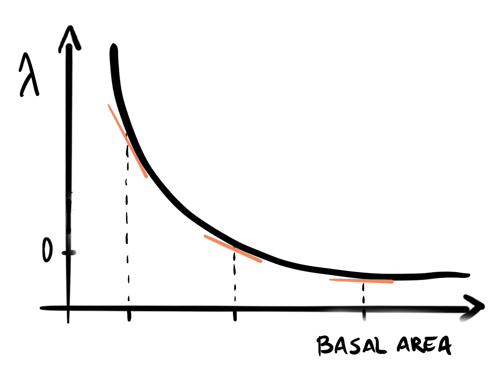]


.cite[Adapté de Caswell 2001 - LTRE]

---

Entre les espèce et dans l'ensemble de leur distribution, $\lambda$ est plus sensible à **temperature** suivi de la **competition conspécifique**


---

Partagé les parcelles entre froide, centre, et chaude pour tester comment la sensibilité varie dans le gradient de temperature

**FIGURE AVEC UNE EXAMPLE DE PARTAGE EN 10%, 90% quantile**

---

Il n'a pas d'effet majeur de changement de sensibilité entres les regions froides et chaudes


---

L'effet est present, mais c'est varié entre les espèces

.center[]

---

Le ratio de la sensibilité entre competition et climate varie entre la limite chaude et froide, et dépant aussi de la position de la espèce dans le gradient de temperature

.center[]

---

# Conclusion

- Effet du climat est superieur à de la compéttion
- L'effet de la copétition augmente dans le centre de l'aire de répartion
- L'effet du climat augmente dans les bordures
- Cet approache ne prendre pas en compte la variabilité des covariables

<br>
- Meilleur comprendre l'effet des **changements climatique** et de l'**aménagement forestier**

---
class: middle, center, inverse

### Comment le taux de croissance ( $\lambda$ ) varie<br>dans le gradient de temperature?

<hr width="100%" align="left" size="0.3" color="orange"></hr>

**Quelle est le rôle de la variabilité de $\lambda$ sur la <br>limite de l'aire de réparation?**


---
# La limite de l'aire de réparation devrait être dependant du climat et de la compétition

<br>

$\lambda \sim Climat + compétition$

.center[

]

.cite[Maguire Jr 1973 Am. Natur.; Holt 2009 PNAS; Fig adapted from Godsoe et al. 2017 TREE]


---
# La limite de l'aire de réparation devrait être dependant du climat et de la compétition

<br>

$\lambda \sim Climat + compétition$

.center[

]

.cite[Maguire Jr 1973 Am. Natur.; Holt 2009 PNAS; Fig adapted from Godsoe et al. 2017 TREE]

---
# La variabilité de $\lambda$ peut augmenter le taux d'extinction

*abies balsamea*

.center[
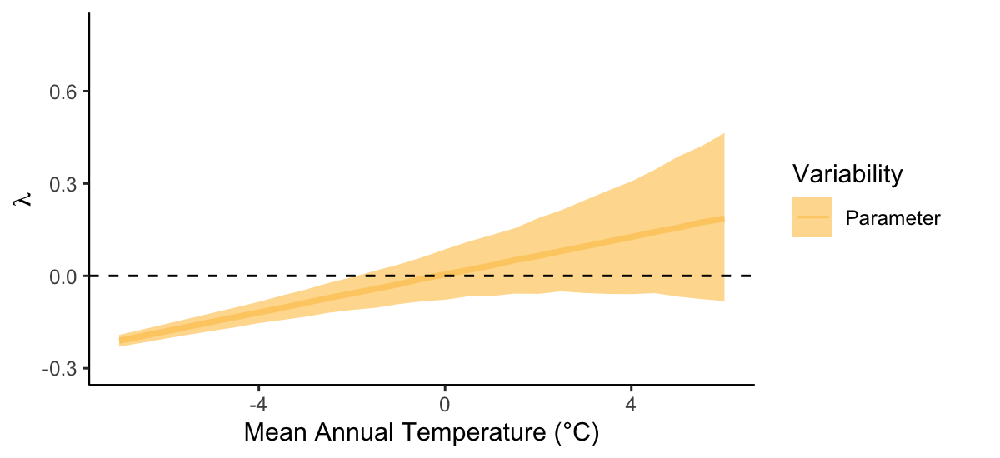
]

---
# La variabilité de $\lambda$ peut augmenter le taux d'extinction

*abies balsamea*

.center[
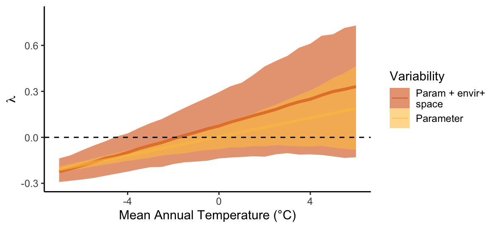
]


---
# La variabilité de $\lambda$ peut augmenter le taux d'extinction

*Picea mariana*

.center[
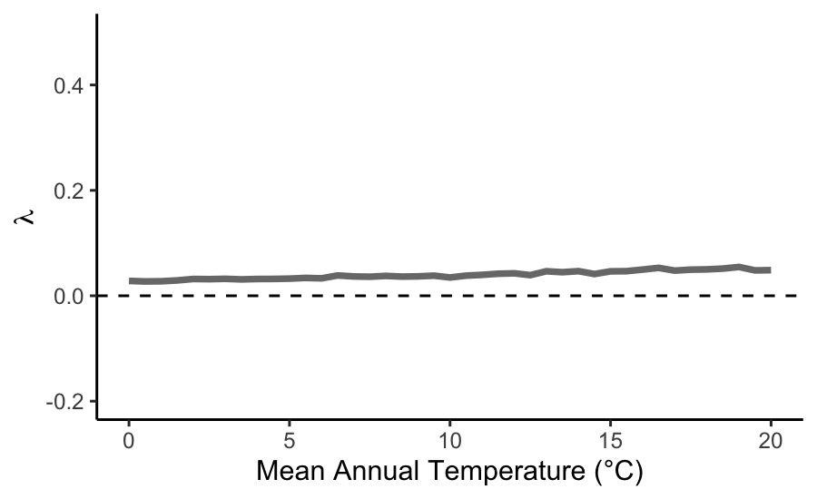
]

---
# La variabilité de $\lambda$ peut augmenter le taux d'extinction

*Picea mariana*

.center[
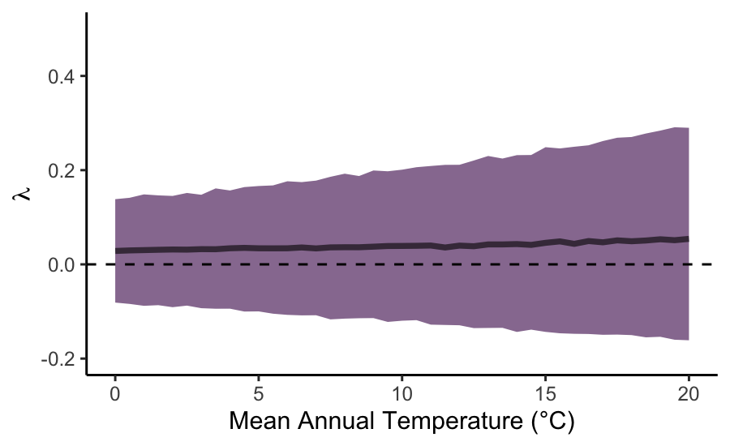
]

---

class: inverse

.pull-left1[
<br>

# Key message here

<br><br><br><br><br><br><br><br>

**Special thanks to**

Nice people
]

.pull-right1[
<br>

]